# twopointsix

A 2.5D top-down stealth **tech demo** in the spirit of Splinter Cell: Chaos Theory, running on WebGPU.
Box-only geometry, diffuse-only materials, and every photon is dynamic: guards' flashlights, muzzle flashes,
switchable ceiling panels, monitors, street light through the windows, moonlight — all ray traced against the
scene every frame, plus a real-time Eulerian smoke solver for gun smoke and smoke canisters.


| | |
|---|---|
| 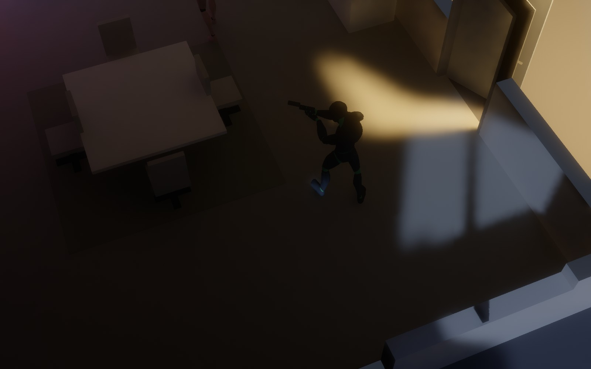 | 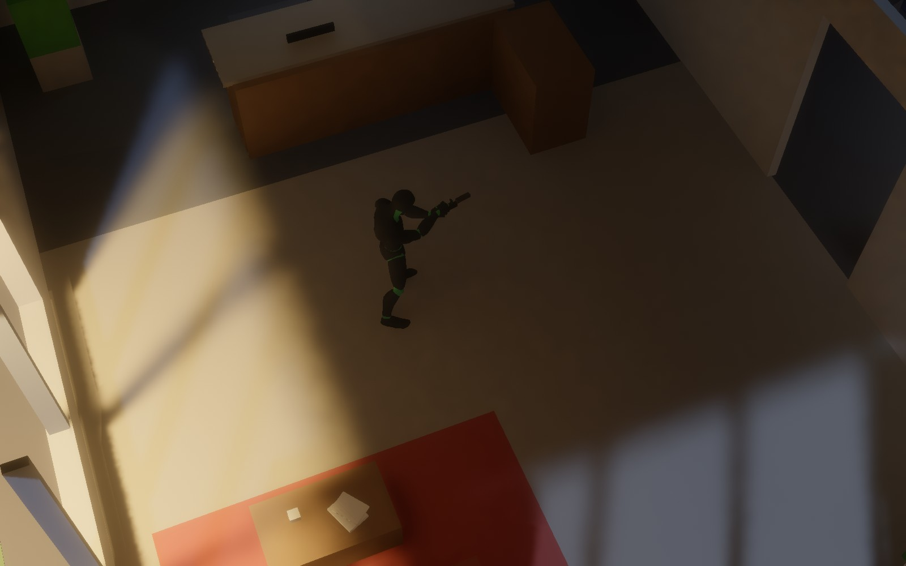 |
| 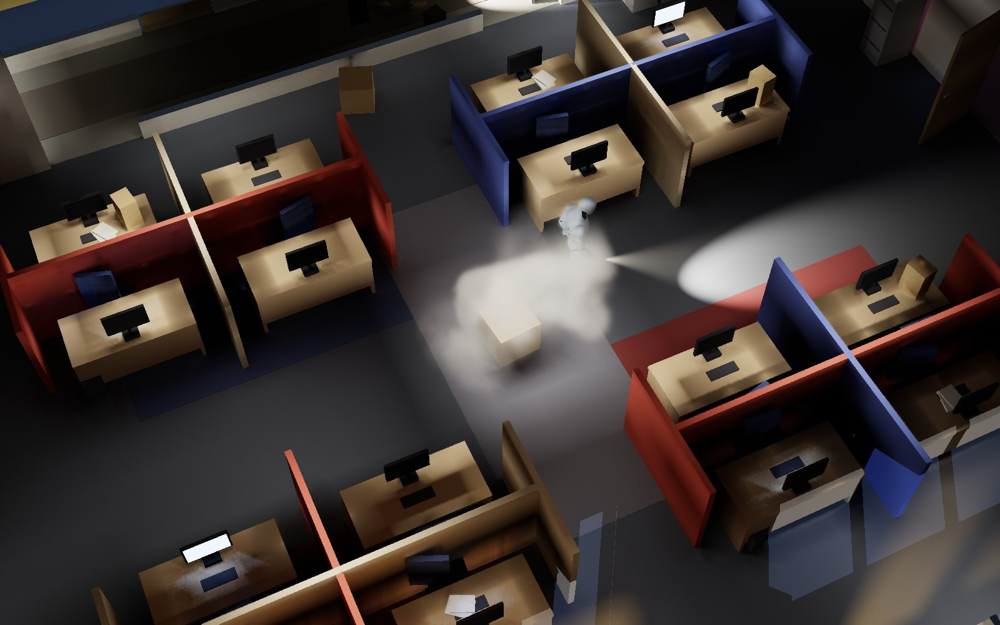 | 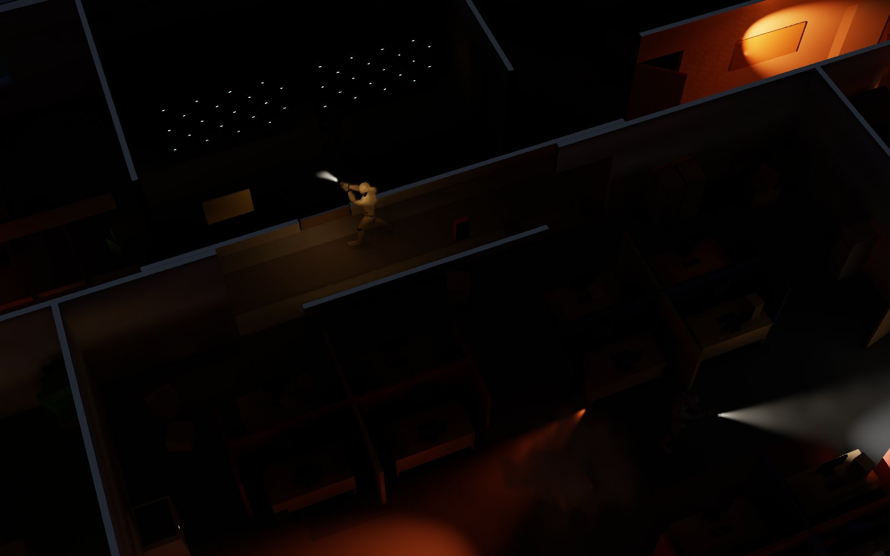 |
| 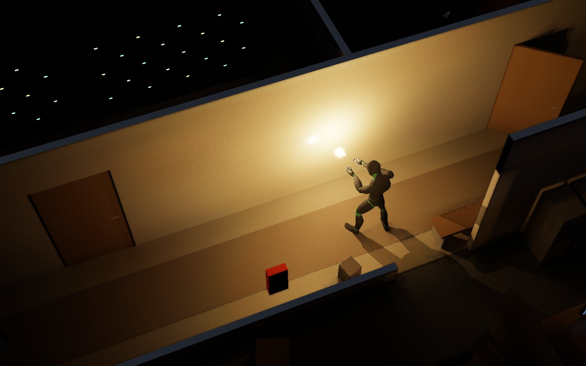 | 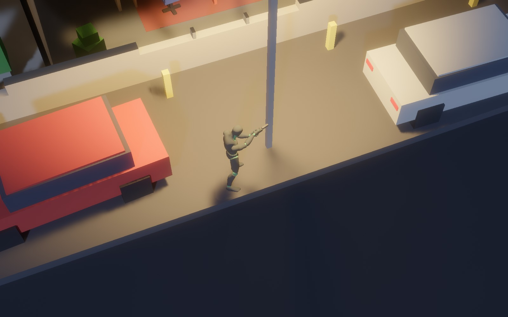 |
| 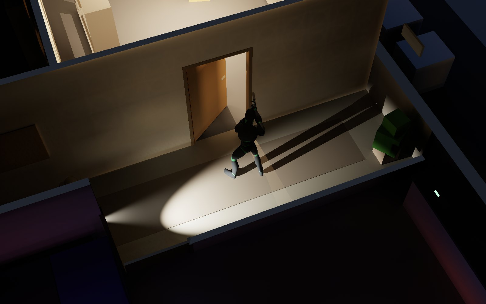 | 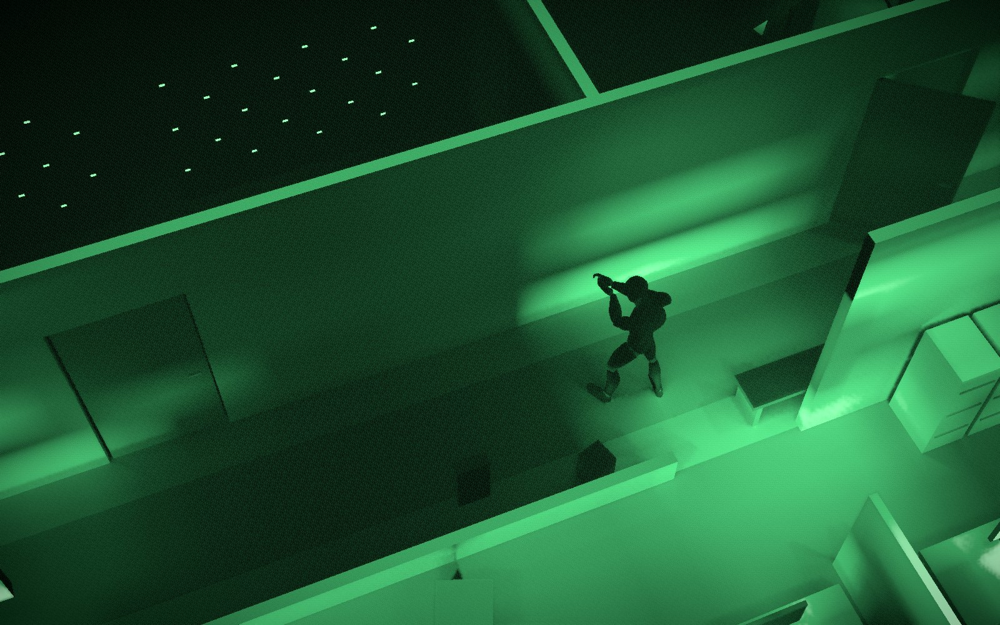 |
| 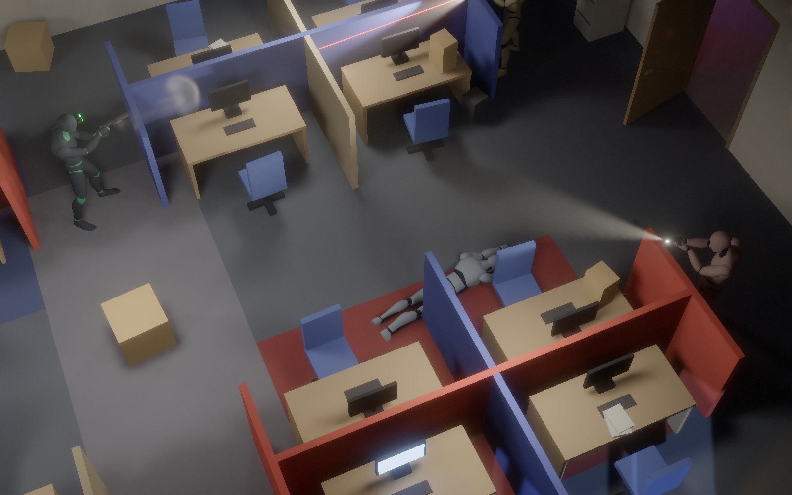 | 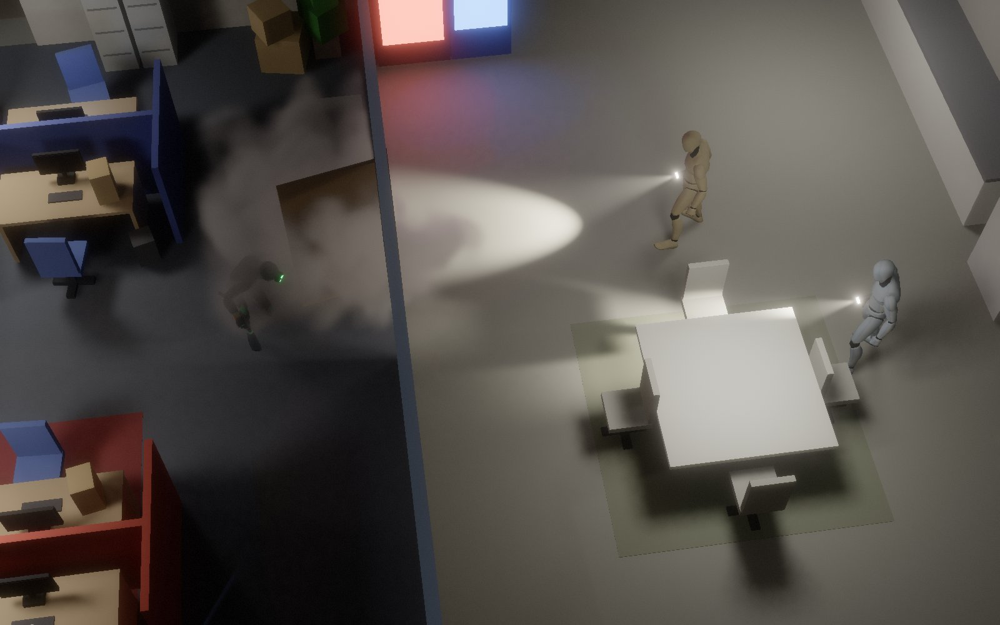 |
| 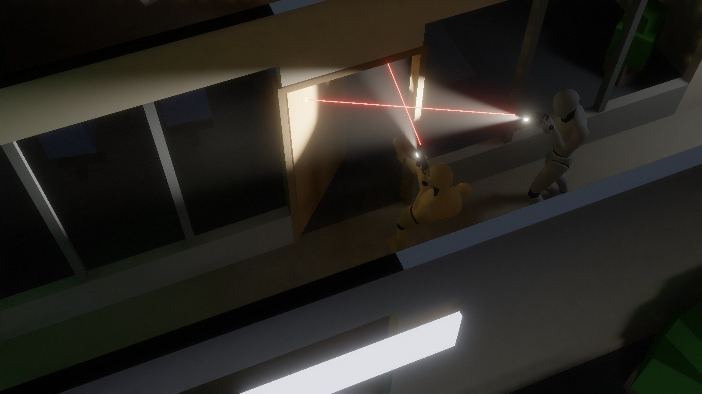 | 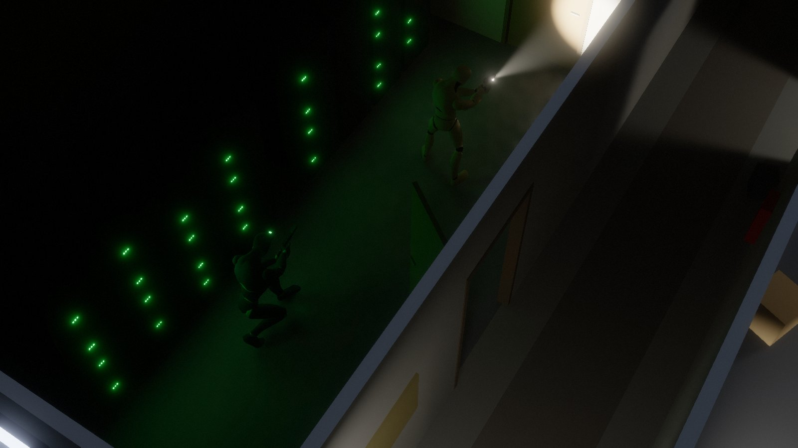 |
| 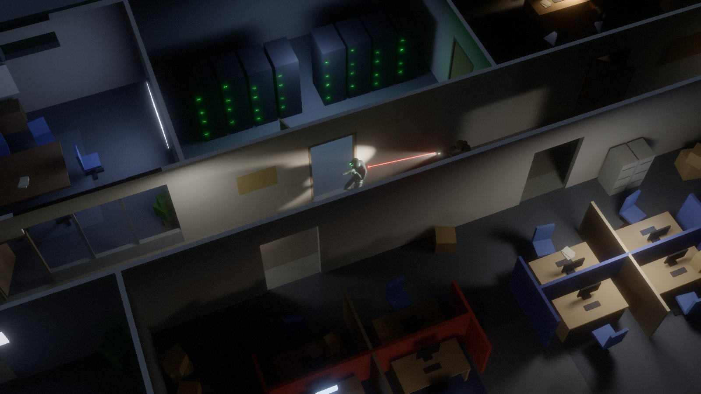 | 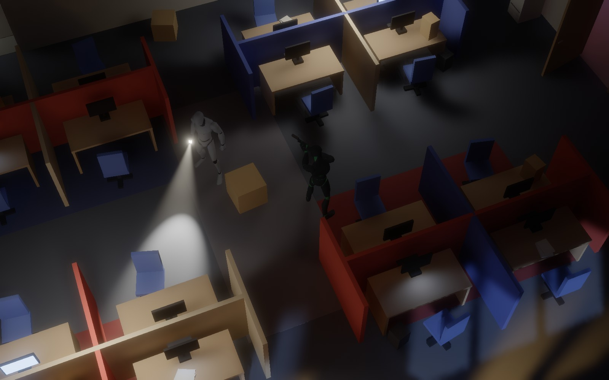 |

<sub>Captured headlessly through the engine's own readback (`__shot()` + `bun run tools/shot-server.ts`), no HUD.</sub>

## Aug 7 — a job to do, doors worth picking, guards who lock the floor down and clear rooms

The sandbox now has a point: **get into the server room, pull the drive from the marked rack, leave by the fire
exit.** One quiet line at the top of the screen says what is next, a small diamond marks it, holding **F** on
rack 6 spins its LEDs down over a few seconds (stay on it — sprinting off or dragging a body lets go), the rack and
its glow strips really drop off the emissive feed, and a few seconds later the nearest calm guard is radioed to go
and look at it. Step out through the fire exit and a **debrief card** rates the run from what the guards themselves
registered — *ghost* (nobody suspicious, no shots, no bodies), *panther* (kills but never seen), *assault* — with the
clock, alerts, bodies found and shots fired.

**Doors have locks.** The server room, the breaker room and the manager's office are locked from the corridor side;
guards carry keys and the closers re-lock behind them. **Hold F** on a locked leaf and Sam plants beside the keyway,
crouched, gun holstered, and works the cylinder for about four and a half seconds with soft clicks that a man a few
metres off in a quiet corridor will half-hear (a ring round the reticle shows the progress; let go and it keeps for a
moment). **Tap F standing, or sprint into it,** and he kicks it in: the lock breaks at the kick's impact frame, the leaf
is flung to its stop, and the whole floor comes — a kicked door is as loud as a shot. Tap F crouched and he just tries
the handle.

**Going loud now costs something you can see.** When an alarm ends with nobody having laid eyes on you the floor
stays *heightened* for a while — patrols walk their routes with **pistols drawn and weapon lights on** instead of
torches, brisker, sharper-eyed — and a second alarm inside that window **locks it down**: the two nearest men pair
up (the follower trails his leader and inherits his suspicions), the third plants himself on the corridor junction
nearest the trouble, doors they pass get pulled shut and picked locks re-locked (a kicked one stays broken, and gets
remarked on), all of it called on the radio and stepped back down when the floor has been quiet long enough. Guards
also draw a visible **laser** while they hunt you, holster their sidearm on the thigh when calm, and speak in
**bubbles** over their heads.

The **showcase tour is twelve stops** and two of the new ones are the systems above played straight: two guards
**clear the conference room** the way they were taught — stack on the door, the squeeze, a real kick, button-hook to
the corners, "checking under the table", "negative contact" — driven through a small squad-script layer over the same
guard code (procedural stack / high-ready / low-ready stances, the kick and the hand signals are new animation layers
on the mocap graph); and **the drive pull itself**, lit only by the racks' green wash, with the corridor man pushing
the door open to sweep the dead rack with his weapon light while Sam sits two metres off in the dark.

Under the hood: **auto quality now calibrates at boot** from a couple of seconds of GPU pass timings behind the start
card (fixed + per-pixel cost model → preset *and* resolution scale in one step, remembered per machine) instead of
crawling down while you suffer, and the pause menu grew a **Graphics — trade-offs** group of honest, measured
switches (a third-resolution bounce gather is the big one: 6.6 → 3.2 ms of a 24.5 ms frame on the reference machine,
hard to see; checkerboard shadow rays, quarter-resolution beams, half-rate bounce cache, fewer rays in near-black).
Three more renderer savings landed only after a pixel A/B said *identical*: per-tile light culling in the direct pass,
whole-tile pass-through in the penumbra filter, and empty-brick skipping in both the smoke solver and every smoke
sampler. The 1,400-line game module was split into mission / combat / guards / player / lighting / squad modules along the way.

## Aug 6 — ragdolls, takedowns, bigger smoke, proven-lossless renderer wins

Gameplay first: guards (and you) now die as **ragdolls** — a 16-particle position-based body with a shape-matched
trunk, stick and swing limits, colliding with the floor, the box grid and door leaves — so nobody folds into a wall
any more, and **dragging a body** pins its ankles to your hands while the rest trails and bumps round corners. Get
close behind a guard who has not clocked you and his marker offers a **silent takedown**. One **F** key now works
every marker (lights, doors, bodies, guards) with a two-line reticle; you go down in one shot like they do, and the
guards cover the body and radio it in instead of "searching" for you. There is a start card and an **Esc pause
menu** with friendly settings and the controls, Chaos-Theory-style **light and sound meters**, an **auto quality**
mode that picks and remembers the preset for the machine, canisters and magazines that tumble in flight, and the
showcase tour gained scripted beats driven through the real player: takedown + drag, a hull-down firefight (double taps into
cover, a stun charge over the top, a flank while they are blind), and a smoke canister screening a watched doorway — presented
with fades over the cuts, a letterbox and slow camera swings.

Renderer and fluid: a small **pixel-exact A/B harness** (`?paused` deterministic boots, lossless readback, image
diffs) let the parked optimisations land one at a time with a measured verdict — the two direct-light emitter
classes are denoised in one dispatch (≤4/255 on <0.03 % of pixels), leaders keep their scored irradiance (exact),
the smoke march shortlists the lights that can matter once per ray (exact) — and the smoke pressure solve moved
from 20 Jacobi sweeps to four red-black SOR pairs (27 → 15 dispatches a step, same plume). That headroom went into
**64³ smoke domains** (gun smoke in a 1.4 m cube, canisters in a ceiling-high 3.5 m cube), a canister worth three of
the old ones, and bore gas that visibly carries past the pistol.

## Lighting pipeline v2 (Aug 5, afternoon)

After a round of "GI blocky, torch shadows janky, direct harsh" and a look back at
[twopointfive](https://github.com/sujayakar/twopointfive) (the noisier path-traced predecessor), the frame was
rebuilt around three ideas: **one sampled estimator for all direct light** (every light is a finite emitter;
per pixel all lights are scored unshadowed, the leaders per emitter class get adaptive stratified shadow rays to
points on their emitters, the tail rides on their visibility, and a ratio-space à-trous filter driven by a PCSS
penumbra hint denoises visibility, never light — transients like muzzle flashes just work and leave nothing
behind), **a per-pixel traced final gather for
indirect** that reads the world-space probe volume only one bounce away (so its coarseness can't be seen: no
probe-scale blotches, real contact darkening, a torch's bounce comes off the exact spot it hits), and an
**HDR post chain** (bloom pyramid + AgX) instead of a clipping tonemap. It is faster than the build it replaces
(8.6–13.2 ms vs 16–17 ms at 1600×1000 on an M4 Max) and its cost no longer scales with the number of lights.
Details under *How the frame is built*.

## Aug 5 — capsule shadows, soft shadows, GI fixes

Playtest feedback first: character shadows are now analytic capsules (no more box-men), sized lights cast
soft shadows with a two-pass edge-aware denoise, the window/GI leaks and street-lamp banding are gone, indirect
light gets a reprojected temporal filter (direct light and beams never do), you cannot clip into walls, sprint is
CoD-style, the Five-seveN has magazines you actually manage, and there is night vision and a rail light.
Then the new toys: a proper kit HUD, thrown smoke canisters with an arc preview and rigid-body bounces, dense
configurable smoke that characters and bullets shove around and that blinds guards, a WebAudio layer where every
sound is synthesized and *propagated* through the level (around corners, through doorways, muffled by closed
doors — guards hear through the same model), a generative Amon-Tobin-ish score driven by the alert level,
physical doors that throw wedges of light as they swing, a mains breaker / blackout event with rotating emergency
beacons, set dressing everywhere, visible hand props (holstered sidearms, the canister standing in the fist, weapon lasers
on hunting guards), a hands-off showcase tour (`P`), quality presets with
adaptive resolution, one-hit-and-you're-down (like the guards) with an encounter restart, and a title card.

## Run

Requirements: [Bun](https://bun.sh) ≥ 1.3 and a WebGPU browser (Chrome/Edge stable, Safari 26+).

```bash
bun run dev          # http://localhost:5173  (character / prop viewer at /viewer — see VIEWER.md)
bun run build        # static bundle in ./dist
bun run typecheck    # uses the vendored TypeScript in ./vendor
```

No npm dependencies. TypeScript is vendored under `vendor/typescript` (fetched from the GitHub release);
WebGPU types live in `types/webgpu.d.ts`.

Quality: the tweak panel has a preset selector (ultra / high / medium / low — resolution cap, beam steps, cascade
probe density, smoke solver iterations; also `?quality=medium` etc. in the URL)
and adaptive resolution is on by default: if the frame rate sinks under ~27 fps the internal resolution steps
down, and creeps back up when there is headroom.

## Controls

| | |
|---|---|
| `WASD` | move (camera relative) · `Shift` sprint (gun down, no aiming) · `C` crouch toggle · `Alt` slow walk |
| mouse | aim · `LMB` fire (slot 1) / throw (slots 2, 3) · `RMB` raise weapon / show throw arc |
| `1` `2` `3` | Five-seveN · smoke canister (arc preview, bounces, 1.3 s fuse) · stun canister (goes off 1.5 s after it lands: bang, white flash, burning fragments, and every guard with line of sight within 8 m is dazzled for a few seconds) · `G` quick-throw from any slot, using whichever canister you selected last |
| `R` | reload — empties are dropped on the floor, partial mags go back to storage, the fullest spare goes in |
| `F` on a door | tap: push it open / pull it shut · hold: crack a closed door open silently a few degrees a second (watch the sliver of light widen) · or just walk into it — sprinting kicks it wide. **Locked** (server, storage, manager, from the corridor): hold F to pick it (~4.5 s, quiet clicks, ring round the reticle) · tap F standing or sprint into it to kick it in (loud — the floor comes) · tap F crouched just tries it |
| `F` / `MMB` | the marker under the cursor: OCP a light fixture (or the torch of the guard under the cursor) for a few seconds · a silent takedown from behind · drag / drop a body · pull the drive from the marked rack (hold) |
| `L` `N` | pistol light · night vision goggles |
| `Enter` | when you are down (one 9 mm hit, same as the guards): restart the encounter — back at the insertion point with full kit, guards back on their routes. `Shift+Enter` restarts any time. God mode lives in the tweak panel |
| `P` | showcase tour — hands-off (your input is locked out except `P`): camera flights through the set pieces plus scripted beats driven through the real player — a silent takedown and body drag, a hull-down firefight ended with a stun charge and a flank, a smoke canister screening a watched doorway — then blackout / restrike / soft shadows, and a fresh encounter handed to you (also `?demo` in the URL) |
| `Tab` | tweak panel: frame, look (exposure, bloom, grain, night-vision tube), direct light (ray budgets, temporal reuse, filter), indirect, cache, lights, smoke, effects, sandbox (blackout / smoke / teleport / spectate buttons, god mode, unlimited ammo, props), audio |
| `` ` `` | cycle debug views (final, albedo, normals, direct, indirect, volumetrics, depth, RC dice, lighting, denoise hints) |
| `[` `]` | exposure · wheel zoom · `Q`/`E` rotate camera (blackout, smoke at cursor, teleport, spectate, AI labels and music are buttons in the Tab panel now) |

Shooting a light fixture (or a bullet passing within ~40 cm of one) breaks it permanently; guards notice lights
going out near them, hear footsteps (muffled through walls), lose you in smoke, and radio in bodies they find.
Doors are physical: characters push them open by walking into them (they swing away from you about the hinge,
carry some momentum, hit their stops, and a closer pulls most of them shut again and latches). They are traced
like everything else, so a door cracking open throws a widening wedge of light — and bounce — into a dark
corridor, and a closed door blocks guard sight lines, muffles footsteps and occludes audio.
Loose furniture is physical too: office chairs, moving cartons, bins and potted plants get shoved out of the way when
anyone walks into them (a chair rolls on, a carton stops dead, a heavy planter slows you down and holds you back
if it is pinned against a wall), bullets and thrown canisters knock them, a swinging door sweeps them aside — and
a chair sent scraping across the lino or a carton smacked by a round is a noise the guards will come and look at.
There is a mains breaker panel in the storage room: OCP it and the building drops to emergency lighting for a
while (exit signs, the UPS-fed server LEDs and five rotating red beacons whose beams sweep the haze — your
visibility pulses with them); shoot it and the power stays off. The nearest guard radios it in and walks over
to reset it; when power returns the fluorescent groups restrike one contactor at a time.
Bottom-left are the light and sound meters: LIGHT is the light meter: the actual irradiance arriving at the player's chest/head, computed
on the GPU with the same shadow rays the renderer uses. Bottom right is the kit: rounds in the magazine (+1 in
the chamber), spare magazines drawn by fill, canisters, gadget states and OCP charge.

## Audio

Everything is synthesized at startup (no samples): suppressed 5.7 mm vs the guards' loud 9 mm, slide/magazine
foley, footsteps by surface, OCP zap, goggle whine, canister clinks and hiss, fixture pops, door creaks/slams,
the mains contactor. Sources are HRTF panned and every one-shot is *propagated*: a clear straight line plays
as-is (side rays soften doorway edges); if walls are in the way the sound is routed around corners along the
walkable space (the nav grid), so a shot in the next room arrives from the direction of the doorway, at the
path's length, slightly muffled — heavily muffled if a closed door sits across that doorway — and only leaks
dully through the mass when there is no route at all. The reverb send is sized from the traced mean free path
around the listener (small storage room vs open cubicle floor vs outdoors). Guards hear through exactly the same
model, so closing a door behind you genuinely masks your footsteps and suppressed shots. The score is generative: drones and sub pulses while you
are a ghost, synthesized breakbeats fading in as suspicion rises, a distorted reese bass and an alert sting when
it goes loud — driven by the guards' state.

## How the frame is built

```
CPU: game → character poses (glTF clips, layered + procedural twist) → skin matrices, RT proxy capsules,
     lights (steady + transient, sharp/broad class bits), smoke emitters → upload boxes (+ 1 m XZ grid), lights, frame uniforms
GPU: smoke sim (per live domain) → G-buffer raster (boxes + skinned meshes)
     → radiance cascades c3..c0 (world space, coarse: a radiance CACHE) → irradiance "dice" volume (short EMA)
     → direct light, full res: score every light unshadowed; per emitter class the leaders (2 sharp / 3 broad)
       get adaptive stratified rays to points on their emitters (up to 8 / 4, stopping once samples agree),
       the tail rides on their visibility → S (shadowed), U (exact unshadowed), signed PCSS penumbra hint
       → optional short validated history → ratio-space à-trous per class (3 passes, strength from the hint)
     → final gather, ½ res: 4 cosine rays per pixel traced through the real scene; hits shaded with the cached
       irradiance + one-ray direct → temporal accumulation (depth-validated, variance-clipped; indirect only)
       → 3 à-trous passes
     → volumetrics + smoke march (½ res) → light-meter / smoke-transmittance probe queries
     → composite (HDR) → bloom pyramid → AgX tonemap / night-vision tube → FXAA + film grain
```

* **Scene = boxes (+ capsules for people).** ~560 static yawed boxes plus dynamic ones (~210 boxes of loose
  furniture driven by a small CPU rigid-body layer — `src/game/props.ts` — door leaves and handles, thrown
  canisters, dropped magazines, hand props, 1-frame muzzle flash cards), re-uploaded each frame
  with a 2D uniform grid (DDA traversal in WGSL). Characters are mirrored into the traced scene as 14 analytic capsules each (sphere-culled per character)
  so bodies cast smooth shadows in flashlight beams. All ray queries (shadow rays, cascade intervals, final-gather
  rays, probe visibility, smoke obstacle voxelization, light meter, audio occlusion on the CPU side) go through
  the same box scene. On the CPU the door leaves are registered as dynamic occluders with the collision layer,
  so guard sight, hearing, audio propagation, bullets and thrown items all respect them; sound that cannot go
  straight is routed over the guards' 0.5 m nav grid (A*, cell-pair cached) — see *Audio*.
* **Direct lighting** (`src/render/shaders/direct.wgsl`, `dtemporal.wgsl`, `softblur.wgsl`) — one estimator for
  every light: per pixel all lights are evaluated unshadowed (exact, analytic); every light is a finite emitter
  (disk in the fixture plane / angular radius for the moon). Lights come in two classes — *sharp* (torches, bulb,
  moon, muzzle flashes) and *broad* (ceiling panels, screens, street lamps, the panels derived automatically from
  the emissive fixtures as one-sided Lambertian area lights). Per class the strongest lights (2 sharp / 3 broad)
  get stratified shadow rays to points on their emitters — up to 8 for the strongest, 4 for the others, but the
  sampling is adaptive: it stops as soon as the first few samples agree, so the budget is only spent inside
  penumbrae — and the rest of the class is credited with the leaders' aggregate visibility (deterministic, no
  selection noise). Each class writes the shadowed estimate S, the exact unshadowed total U and a signed
  PCSS-style penumbra-width hint (own measurement vs inherited); an optional short, depth-validated,
  variance-clipped history integrates a few frames, and the denoiser filters the *ratio* S/U — never the light
  itself — with an edge-stopped à-trous whose strength follows the hint, so cone edges and unshadowed light stay
  per-pixel exact, contact shadows stay hard and distant penumbrae open up. Ray budgets, history weight, pass
  count and filter cap are live in the panel. Transient lights (muzzle flashes, the stun canister) need no
  special casing: the variance clip follows their abrupt change and they never enter any indirect cache.
* **Indirect lighting** (`fgather.wgsl`, `temporal.wgsl`, `giblur.wgsl`, cache in `rc.wgsl`): a half-resolution
  stochastic **final gather** — 4 cosine-distributed rays per pixel traced through the real box/capsule scene
  (so contact darkening, colour bleeding and a torch's bounce off the exact spot it hits all come out per pixel);
  at each hit the outgoing radiance is albedo/π × (one-ray direct estimate over the *steady* lights — or the
  on-screen denoised direct term when the hit is visible — plus the cached multi-bounce irradiance) + emission,
  misses take the sky. The cache is the old radiance-cascade probe volume, now coarse (1 m) and only ever read
  one bounce away from the eye, where its resolution cannot be seen. Accumulation is temporal (reprojected,
  depth-validated, variance-clipped — indirect only) followed by three edge-aware à-trous passes and a joint
  bilateral upsample. Transient lights are kept out of every accumulated signal (gather hits, cascades, dice),
  so a flash cannot outlive itself as bounce.
* **Volumetrics** (`volumetrics.wgsl`): thin uniform haze, in-scattering from spot/point lights integrated along
  the analytic ray∩cone (or sphere) interval with shadow rays per step; smoke domains are ray-marched with single
  scattering from all lights (shadowed, self-shadowed) plus cascade ambient.
* **Smoke** (`src/smoke`): pool of 8 Eulerian domains (64³ each: 2.2 cm voxels = a 1.4 m cube for gun smoke, 5.5 cm = a ceiling-high 3.5 m cube for
  canisters) placed on demand around emitters. Semi-Lagrangian velocity advection, MacCormack scalars, curl +
  vorticity confinement, buoyancy, procedural turbulence, red-black Gauss-Seidel (SOR, four sweep pairs) pressure projection with per-emitter divergence
  sources (a burst pushes its neighbourhood apart through the solve), obstacles voxelized from the box scene, a
  dissipation band at the open faces, idle domains retired via a mass reduction readback. Effect presets (bore and
  port gas, wisps, the stun canister's jets and spark trails) live in `src/game/effects.ts`; sparks are CPU
  particles drawn as emissive streak boxes (`src/game/sparks.ts`).
* **Characters** (`src/anim`, `src/game/character.ts`): Quaternius Universal Animation Library mannequin (CC0)
  loaded from glTF; locomotion blend (idle/walk/jog, crouch set) with speed-matched playback, upper-body layers
  (relaxed / two-hand aim with pitch blend / shoot / hit / reload / throw / takedown strike), procedural spine
  twist for aim, reversed cycle for backpedalling, GPU skinning. Deaths hand the skeleton to a ragdoll
  (`src/game/ragdoll.ts`): 16 Verlet particles seeded from the bones and their velocities, a shape-matched rigid
  trunk, stick limbs with cone / fold / knee-direction limits, sphere-vs-box collision against the floor, the
  static grid and door leaves (a body slumps against the wall it died at, slides under a desk but not into it),
  Coulomb friction, sleep; the mesh is posed from the particles (trunk rotation on the hips, parent-relative
  swings on the limb joints, the frozen death pose everywhere else). Dragging a body pins its two ankle particles
  to the player's hands. Limbs are mirrored into the ray-traced scene as analytic capsules (see above); held props
  (suppressed pistol, torches with a lit lens) are small raster-only boxes on the hand bones.
* **Game layer** (`src/game`): light targets (analytic fixtures, emissive switchables, the mains breaker) with OCP
  knock-out + fluorescent restrike and a separate mains-supply state for the blackout; hinged doors with a
  contact/impulse model; loose furniture as 3-DOF rigid bodies (x, z, yaw: character shoves with two-way
  hold-back, oriented-box SAT against the static scene and each other, per-kind ground friction, sleeping,
  bullet / canister / door-leaf impulses, scrape and thud events into the hearing model — never sight or nav
  occluders); guard perception = FOV/LOS + the GPU light meter + smoke transmittance queries + the
  shared sound propagation, feeding a patrol / suspicious / alert / search state machine on the nav grid;
  a scripted showcase tour drives the same systems.

## Layout

```
src/gpu        device/timer helpers          src/render   passes, WGSL shaders, lights, RC, probes
src/scene      level authoring, boxes, grid  src/smoke    fluid solver (WGSL) + domain pool
src/anim       glTF loader, poses, skinning  src/game     player/guards/weapons/lights logic, camera, input
src/ui         HUD overlay + tweak panel     tools/       dev server, build, screenshot sink
public/assets  Quaternius UAL (CC0)          docs/shots   captures used in this README
```

## Credits

Character mesh and animations: **Universal Animation Library (Standard)** by Quaternius — CC0
(https://quaternius.com). Everything else authored here.
