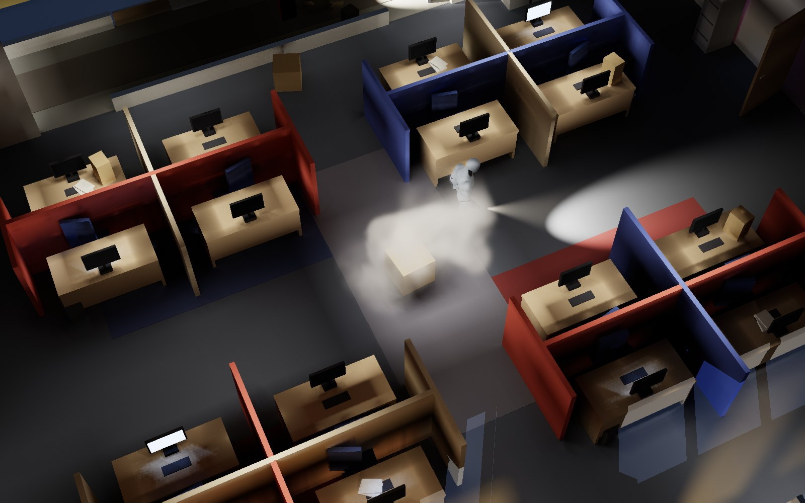
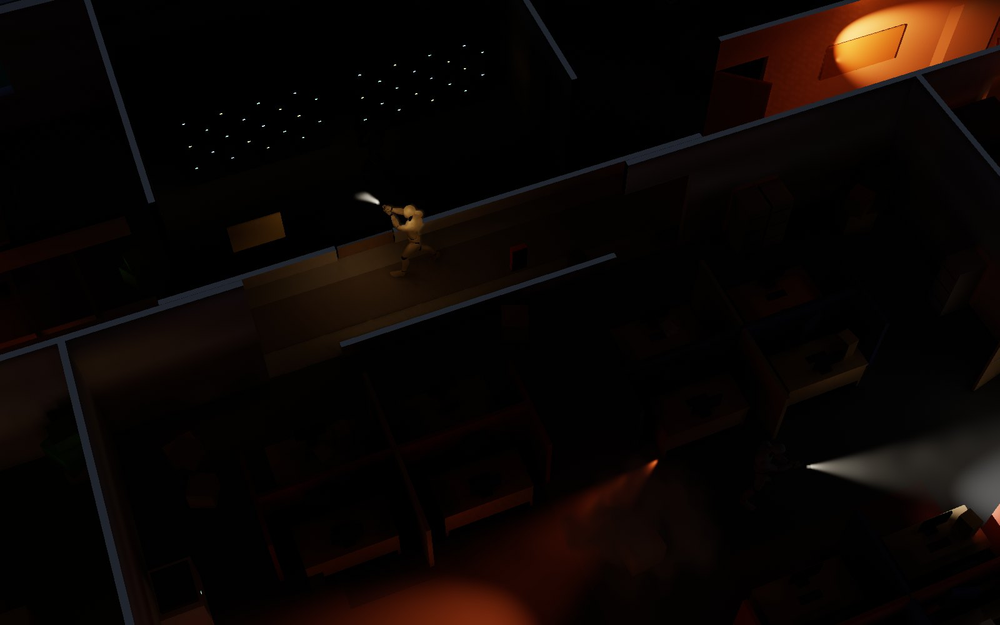
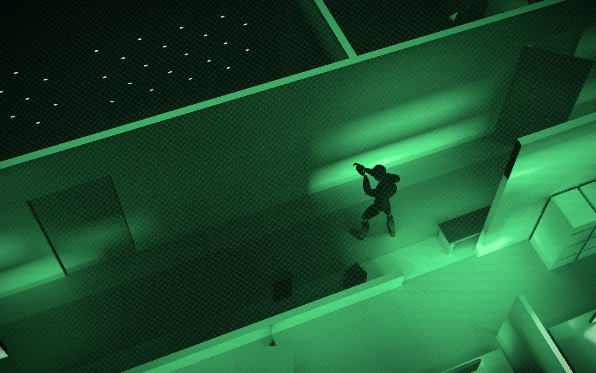

# twopointsix

A top-down squad tactics and stealth game on raw WebGPU. You lead up to four teammates through an orders menu,
or go in alone and unseen. Levels are built from boxes, and every light, shadow and wisp of smoke is live.

| | |
|---|---|
|  |  |
|  |  |
|  |  |
|  |  |

## Run

You need [Bun](https://bun.sh) 1.3 or newer and a WebGPU browser (Chrome or Edge stable, Safari 26+). There are no npm dependencies.

```bash
bun run dev      # the game at http://localhost:5173
bun run build    # static bundle in ./dist
```

On Windows, Chrome compiles the shaders with DXC, which is slow, and its GPU process keeps only 6 MB of compiled shaders in
memory, less than this game's set, so most of them are compiled again on each load. The game waits only for the ones its first
frames draw and compiles the rest in the background, so the first seconds after a load can still stutter.

## Play

Pick a mission, pick who comes and what they carry, deploy. Every key is also listed in the game under Controls.

| | |
|---|---|
| `W A S D` | move · `Shift` sprint · `C` crouch · wheel sets your walking pace |
| mouse | aim · `LMB` fire or throw what is in hand · `RMB` the pistol's light jammer, the rifle's launcher |
| `Space` | do the highlighted action · hold to pick another |
| `1` to `5` | pistol · rifle · smoke · stun · frag |
| `` ` `` | empty hands: what is in them goes away · a digit draws |
| a wall | walk into it and your back goes to it · a step away lets go |
| `R` · `L` · `N` · `V` · `Z` | reload · weapon light · night vision · whistle · semi or auto |
| `X` · `Q` · `T` · `F` | squad: order menu · the usual order · who takes it · give the word |
| `Ctrl` + mouse | orbit the camera · `Ctrl` + wheel zooms |
| `Esc` · `\` | pause and settings · the debugger, with every knob |

`F7` saves a replay of the last five minutes and `Shift+F7` opens it in the viewer at `/replay`.

## What is in it

- **One model for the picture and the AI.** Enemies see by the same light meter and through the same smoke you are shown,
  and hear by the same sound paths the mixer plays.
- **Light.** Ray-traced direct light from sized emitters, a traced final gather over a radiance cache, volumetric beams.
  Shoot out a lamp or throw the breaker and the room really goes dark.
- **Smoke.** A GPU fluid solver. Smoke blocks sight, drifts with the vents and the wind, and stops at a shut door.
- **A squad.** Stack on a door, bang and clear, breach with a charge, hold, cover, go silent. Teammates fight on their own judgement.
- **Doors, glass and walls.** Doors swing one way, lock, get picked, kicked or blown. Glass cracks and falls. Walls and furniture come apart.
- **Levels are data.** JSON files under `levels/`, with an editor to make more.
- **A look.** Flat-coloured boxes under real light: [STYLE.md](STYLE.md).

## Tools

| | |
|---|---|
| `/workbench` | level editor and character viewer in one page: [docs/level-format.md](docs/level-format.md), [VIEWER.md](VIEWER.md) |
| `/replay` | scrub a saved replay on a map and leave notes on it |
| `/?bench`, or Extras ▸ Benchmark on the title | hands off, about seven minutes: three floors played by the game itself (night snow, a block with the lights out, a storm), then every quality level and heavy feature timed on your machine. It ends on a short text to copy (your GPU, load times, frames a second) and saves the numbers as a file. Nothing is sent anywhere |
| `bun run tools/qa/probes.ts list` | the headless checks: the whole game runs without a GPU, about a second per simulated minute |
| `sh tools/qa/gate.sh all-quick` | the wide set, slow |
| `bun run qa` | typecheck, every mission played to its end, a tour and a soak |

`bun run typecheck` and `bun run qa` expect a TypeScript compiler unpacked at `vendor/typescript`, which is not in the repo.
Any recent `tsc` does the typecheck: `tsc --noEmit -p tsconfig.json`.

## Layout

```
src/render   passes, WGSL shaders, lights      src/game    the simulation: player, squad, enemies, doors, kit
src/smoke    the smoke solver                  src/scene   level format, loader, collision, sound paths
src/anim     glTF loader, skinning             src/audio   mixer, score, synthesized effects
src/ui       menus, HUD, the debugger          src/host    one stand-up and frame order for page and harness
src/editor   src/viewer   src/workbench        src/replay  the replay file and its viewer
levels/      every level as JSON               tools/      dev server, build, level generators, qa/
public/      models and animations             docs/       level format, notes, captures
```

## Credits

Base character mesh and animations: **Universal Animation Library (Standard)** by Quaternius, CC0
(https://quaternius.com). Everything else was made here.
